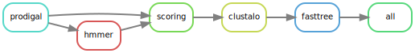

# 木槌
## kizuchi

 A `snakemake` workflow
for building gene trees from HMM profiles.

---

`kizuchi` is a [`snakemake`](https://snakemake.readthedocs.io/en/stable/)
workflow for building phylogenetic trees from 

- gene prediction using [`prodigal-gv`](https://github.com/apcamargo/prodigal-gv)
- gene annotation using [`hmmer`](http://hmmer.org/)
- ortholog scoring
- amino acid alignment using [`clustalo`](http://www.clustal.org/omega/)
- tree inference using [`fasttree`](http://www.microbesonline.org/fasttree/)

