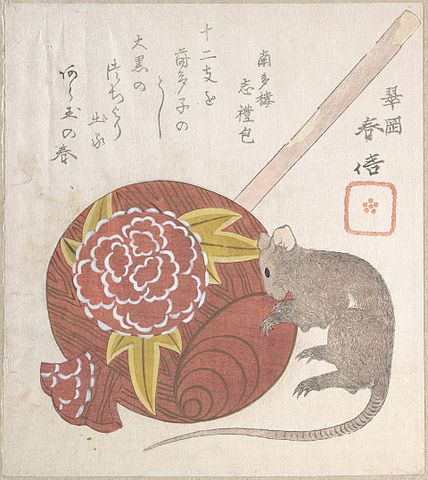

# 木槌 : kizuchi

A `snakemake` workflow for building gene trees from HMM profiles.

---

`kizuchi` is a [`snakemake`](https://snakemake.readthedocs.io/en/stable/)
workflow for building gene trees trees, starting from a collection of genomes
and HMM profiles, and then analyzing the phylogenetic histories of alleles
within genome-level ANI clusters. The aim of this workflow is to automate and
document gene tree analysis in a reproducible way, with the ultimate objective
of tracing recombination across timescale domains.

- gene prediction using [`prodigal-gv`](https://github.com/apcamargo/prodigal-gv)
- gene annotation using [`hmmer`](http://hmmer.org/)
- ortholog scoring
- amino acid alignment using [`clustalo`](http://www.clustal.org/omega/)
- alignment trimming using [`trimal`](https://vicfero.github.io/trimal/)
- tree inference using [`fasttree`](http://www.microbesonline.org/fasttree/)
- genome clustring using [`fastANI`](https://github.com/ParBLiSS/FastANI)
- phylogenetic correlations using [`SuchTree`](https://github.com/ryneches/SuchTree)

